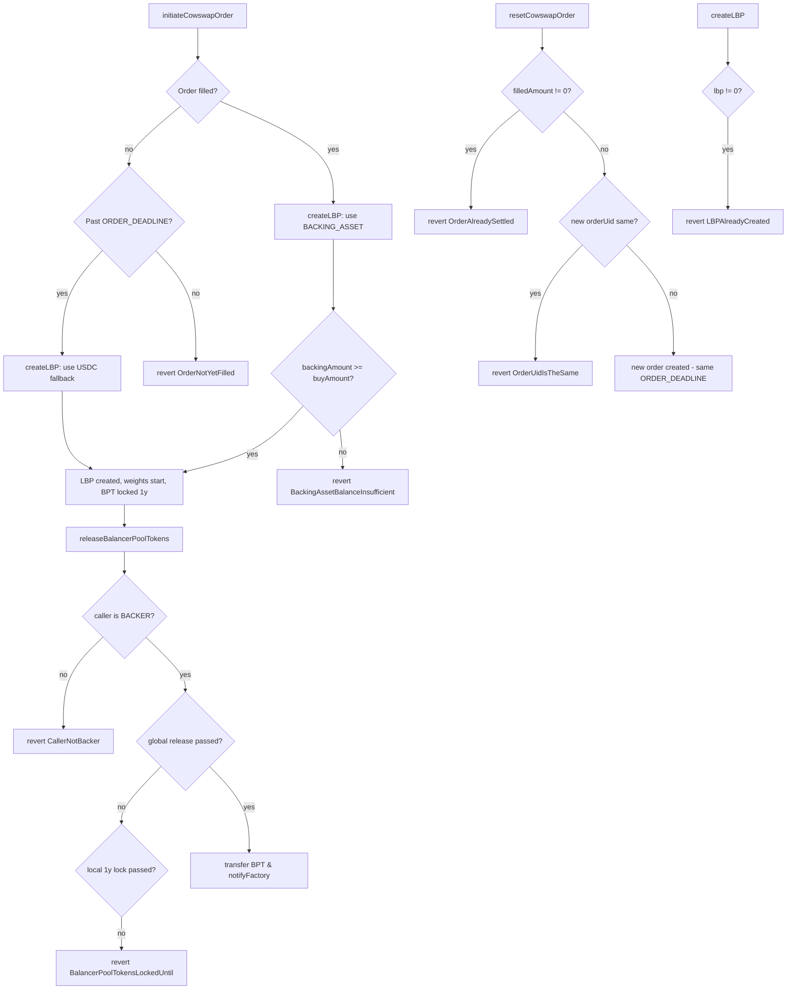

```mermaid
flowchart TD
  A[initiateCowswapOrder] --> B{Order filled?}
  B -- yes --> C[createLBP: use BACKING_ASSET]
  C --> C1{backingAmount >= buyAmount?}
  C1 -- yes --> D[LBP created, weights start, BPT locked 1y]
  C1 -- no --> E[revert BackingAssetBalanceInsufficient]
  B -- no --> F{Past ORDER_DEADLINE?}
  F -- no --> G[revert OrderNotYetFilled]
  F -- yes --> H[createLBP: use USDC fallback]
  H --> D
  %% reset path
  I[resetCowswapOrder] --> I1{filledAmount != 0?}
  I1 -- yes --> J[revert OrderAlreadySettled]
  I1 -- no --> I2{new orderUid same?}
  I2 -- yes --> K[revert OrderUidIsTheSame]
  I2 -- no --> L[new order created - same ORDER_DEADLINE]
  %% double-create
  M[createLBP] --> M1{lbp != 0?}
  M1 -- yes --> N[revert LBPAlreadyCreated]
  %% release BPT
  D --> R[releaseBalancerPoolTokens]
  R --> R1{caller is BACKER?}
  R1 -- no --> R2[revert CallerNotBacker]
  R1 -- yes --> R3{global release passed?}
  R3 -- no --> R4{local 1y lock passed?}
  R4 -- no --> R5[revert BalancerPoolTokensLockedUntil]
  R3 -- yes --> R6[transfer BPT & notifyFactory]

```